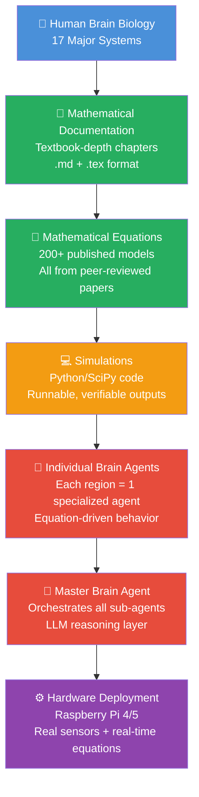
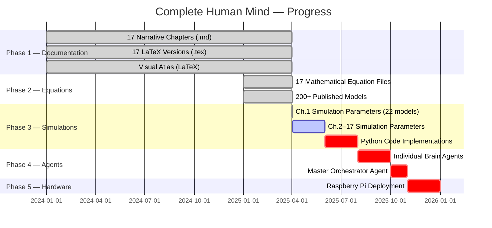
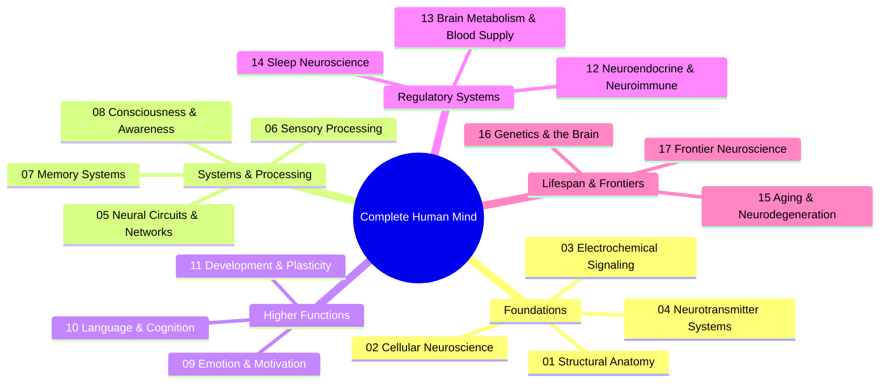
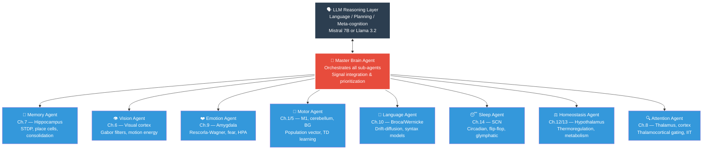
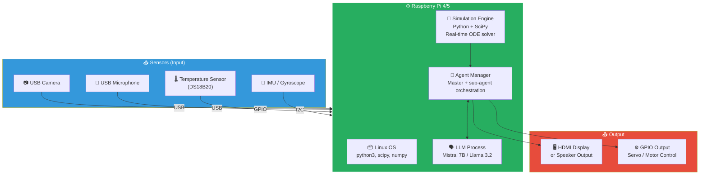

# The Complete Human Mind
### A Biologically-Grounded AI System — From Neuroscience to Hardware

> **A side project that got too big to ignore.**
>
> I'm an electrical engineer + AI developer, not a neuroscientist.
> But I got curious: what if you could describe the entire human brain mathematically, simulate every function in code, build each region as an AI agent, and run it all on real hardware?
>
> So I did. Here it is.

**By:** [Tanveer Hussain](https://www.linkedin.com/in/tanveer-hussain-277119196/) — AI/ML Developer | n8n Automation Engineer | EE Graduate

**GitHub:** [github.com/tannu64](https://github.com/tannu64) | **Email:** agapaitanveermou@gmail.com | **Upwork:** Top Rated (100+ projects)

---

## The Vision

Most AI systems claim to be "brain-inspired." But they ignore the actual mathematics.

I wanted to know: **What if you built an AI that *actually follows* the published equations of neuroscience?**

Not simplified metaphors. Not vague analogies. The real Hodgkin-Huxley equations. The real STDP plasticity rules. The real dopamine temporal-difference learning. Every function of the brain — documented, modeled mathematically, simulated in code, and structured as an agent that can actually run.

This is my attempt.

---

## Architecture — The Full Roadmap



---

## Current Implementation Status



---

## What's Been Built

### Phase 1 — Complete ✅

**17 Complete Neuroscience Chapters**

Each one is textbook-depth. Not summaries. Real content covering the biology, circuitry, and function of one major brain system.



---

### Phase 2 — Complete ✅

**200+ Published Mathematical Models**

Every brain function from the chapters is paired with the original published equations.

Examples:
- **Hodgkin-Huxley** (1952) — Action potentials
- **Population Vector** (Georgopoulos 1986) — Motor cortex decoding
- **Gabor Filter** (Jones & Palmer 1987) — V1 edge detection
- **STDP** (Bi & Poo 1998) — Synaptic plasticity
- **Place Cells** (O'Keefe 1971) — Hippocampal navigation
- **TD Learning** (Schultz 1997) — Dopamine & reward
- **Drift-Diffusion** (Ratcliff 1978) — Decision making
- **Rescorla-Wagner** (1972) — Fear conditioning
- **Wilson-Cowan** (1972) — Cortical oscillations
- **Grid Cells** (Hafting 2005) — Hexagonal spatial coding
- **Goldbeter Circadian** (1995) — 24-hour oscillations
- And 190+ more...

---

### Phase 2.5 — Chapter 1 Simulations Complete ✅

Every equation in Chapter 1 now has:
- Canonical parameter values from literature
- Step-by-step simulation procedure
- Expected outputs and verification tests
- Solver recommendations (RK4/Euler/event-driven)

**File:** `01_Structural_Anatomy/Simulations/Structural_Anatomy_Simulations.md`

---

## Project Stats

| Item | Count |
|------|-------|
| Complete chapters | 17 |
| Total files | 68+ |
| Published equations documented | 200+ |
| Original papers cited | 150+ |
| Ch.1 simulation-ready models | 22 |
| Planned sub-agents | 8+ |
| Target deployment platform | Raspberry Pi 4/5 |

---

## Planned Agent Architecture



---

## Planned Hardware Architecture



---

## What Makes This Different

| Other AI Systems | This Project |
|-----------------|-------------|
| Loosely "brain-inspired" | Exactly follows published neuroscience equations |
| Black box | Every behavior traceable to a real brain region + equation |
| One monolithic model | Network of specialized agents (like actual brain regions) |
| Software simulation | Designed for physical hardware deployment (Raspberry Pi) |
| Generic parameters | Every value is a measured biological measurement |
| Ignores neuroscience | Grounded entirely in computational neuroscience literature |

---

## File Structure

```
Complete Human Mind/
├── README.md                               ← You are here
├── 00_Overview.md                          ← Master index & key facts
├── Complete_Human_Mind_Visual_Atlas.tex    ← LaTeX visual atlas
│
├── 01_Structural_Anatomy/
│   ├── Structural_Anatomy.md               ← Chapter content
│   ├── Structural_Anatomy.tex              ← LaTeX version
│   ├── Mathematical_Equations/
│   │   ├── Structural_Anatomy_Mathematical_Equations.md   ← 22 models
│   │   └── Structural_Anatomy_Mathematical_Equations.tex
│   └── Simulations/
│       └── Structural_Anatomy_Simulations.md              ← Simulation params ✅
│
├── 02_Cellular_Neuroscience/ ... (same structure × 16 more chapters)
└── 17_Frontier_Neuroscience/
```

Each chapter folder contains:
- Narrative (.md + .tex)
- Mathematical equations companion (.md + .tex)
- Simulation parameters (in progress for Ch.2–17)
- Code implementations (planned)

---

## Roadmap — What's Next

| Phase | Status | What's Happening |
|-------|--------|------------------|
| **1 — Documentation** | ✅ Complete | 17 chapters, all .md + .tex files |
| **2 — Equations** | ✅ Complete | 200+ models from published papers documented |
| **2.5 — Simulation Parameters** | 🔄 In Progress | Ch.1 done; Ch.2–17 pending |
| **3 — Python Code** | 📋 Planned | Runnable simulations for every model (SciPy + NumPy) |
| **4 — Agent Modules** | 📋 Planned | Each brain region as a standalone agent |
| **5 — Master Orchestrator** | 📋 Planned | Coordinates all sub-agents + LLM reasoning |
| **6 — Hardware Deployment** | 📋 Planned | Raspberry Pi with real sensors |

---

## How to Use This

1. **As a textbook:** Read the chapters (01–17) for comprehensive neuroscience reference
2. **As an equation library:** Find any brain function in the Mathematical_Equations files
3. **As simulation parameters:** Run the simulation models (Python, MATLAB, Brian2, NEURON)
4. **As agent templates:** When agent code is released, use these as your agent behavior specifications
5. **As a hardware blueprint:** When hardware code is released, deploy to Raspberry Pi

---

## Contributing

Contributions welcome. This is open source (MIT License). If you want to:
- **Add a simulation** — pick a chapter, find an equation, write the Python code
- **Build an agent** — pick a brain region, implement its behavioral spec
- **Deploy to hardware** — help port the agent system to Raspberry Pi
- **Improve documentation** — typos, clarity, citations

Just fork and PR.

---

## Suggested LinkedIn Post

```
Side project I've been working on quietly.

I'm an EE + AI engineer — not a neuroscientist.
But I got curious: can you describe the entire human brain in mathematics?

So I built it.

17 chapters. 200+ published computational neuroscience models.
Every brain function — Hodgkin-Huxley neurons, hippocampal place cells, 
dopamine TD learning, circadian oscillators — all documented from original papers.

The endgame: each brain region becomes an AI agent.
A master agent orchestrates them all.
It runs on a Raspberry Pi.

It's open source. Still building.

[GitHub link]

#AI #NeuralNetworks #ComputationalNeuroscience #OpenSource #SideProject #EE #ADHD
```

---

## About

This started as a curiosity. I'm an electrical engineer by training, AI developer by trade. One day I wondered: *"What if I could express every brain function as a mathematical equation, then build agents that follow those equations?"*

Most of my work is automation and AI — n8n workflows, Python backends, prompt engineering. But this project scratches a different itch. It's asking: **What would an intelligence look like if it were truly grounded in neurobiology?**

It's still very much a work in progress. But it's open source and it's going on GitHub.

---

## Links

- **GitHub:** [github.com/tannu64](https://github.com/tannu64)
- **LinkedIn:** [linkedin.com/in/tanveer-hussain-277119196](https://www.linkedin.com/in/tanveer-hussain-277119196/)
- **Upwork:** Top Rated | 100+ completed projects
- **Email:** agapaitanveermou@gmail.com

---

## License

MIT — Free to use, fork, teach from, and build on.

---

*Built by an electrical engineer who got curious about how brains work and decided to build one.*
